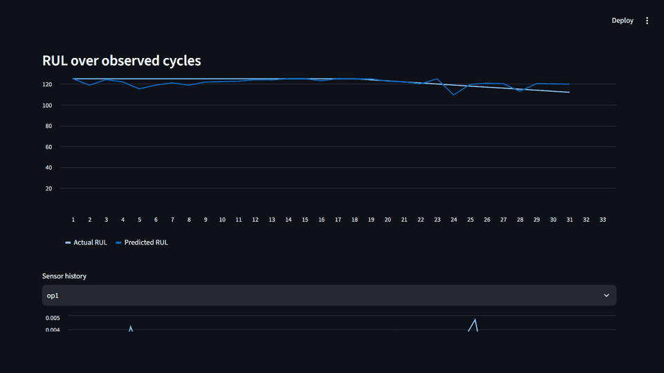
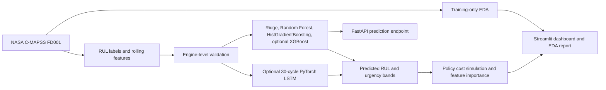
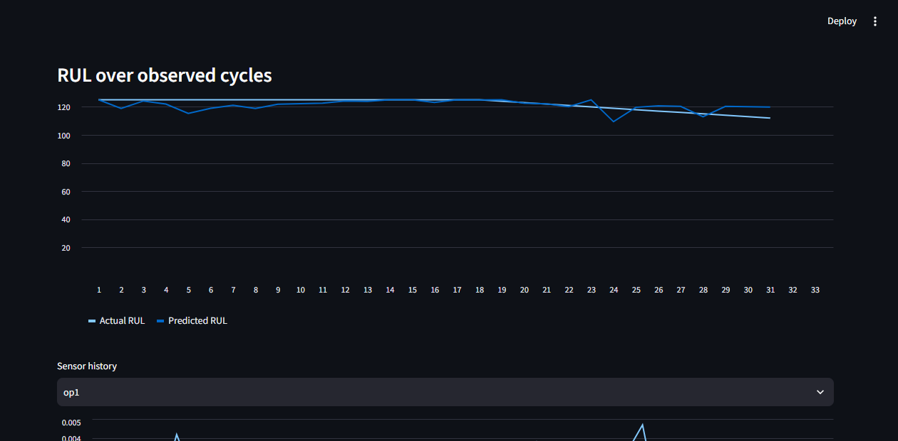
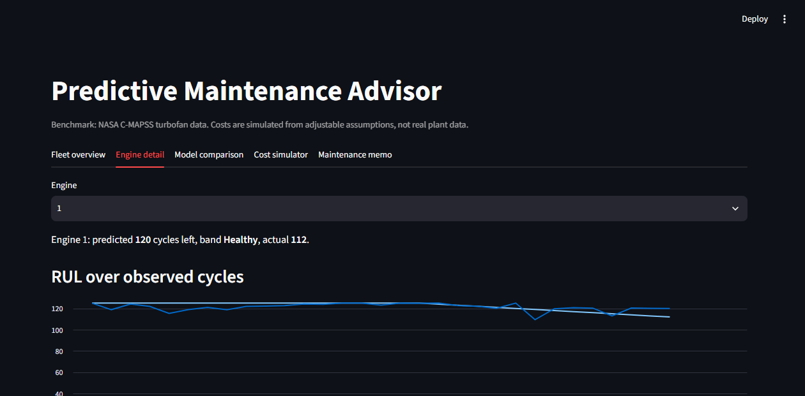
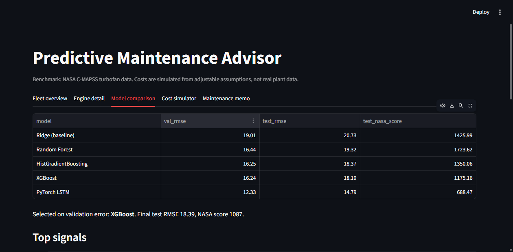
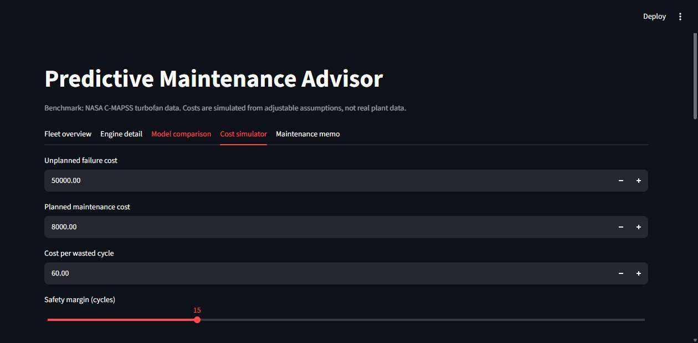
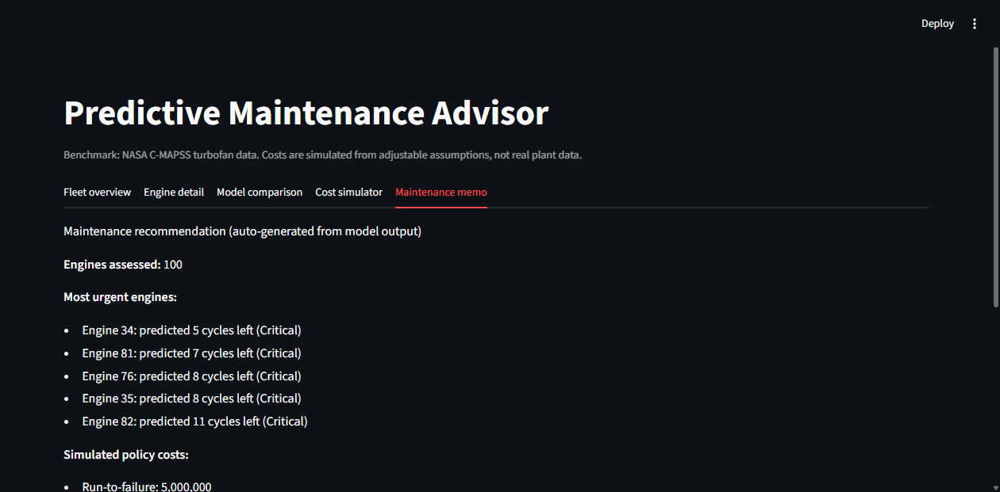

# Predictive Maintenance Advisor



**Built by Harsh Pandey with Mentors and Internet assisted development.**

A benchmark project that estimates remaining useful life (RUL) from engine sensor histories, ranks test engines by urgency, and compares maintenance policies under explicit cost assumptions. The data is NASA's simulated C-MAPSS turbofan benchmark, not data from a manufacturing client.

**Stack:** Python, pandas, NumPy, scikit-learn, optional XGBoost and PyTorch, FastAPI, Streamlit, Docker, GitHub Actions.

## Consulting summary

- **Problem:** A maintenance team needs to prioritize engines before failure without servicing every engine on a fixed schedule.
- **Approach:** For FD001, the pipeline labels RUL with a 125-cycle cap, engineers rolling mean/std/delta features, compares regressors using an engine-level validation split, and converts predicted RUL to maintenance bands. A separate EDA report summarizes per-engine sensor trends and engine lifetimes. An optional PyTorch LSTM uses 30-cycle windows and the same engine-grouped validation approach.
- **Measured result:** Among the four default regressors, XGBoost was selected on validation RMSE (16.24). After refitting on all training engines, final test RMSE was **18.39 cycles** and the NASA score was **1,087**. In a separate LSTM experiment, validation RMSE was **12.33** and final-cycle test RMSE/NASA score were **14.79 / 688**. The LSTM run is not the default model saved for the API; this is one benchmark run, not a production claim.
- **Business simulation:** Across 100 test engines, estimated costs were **$5,000,000** for run-to-failure, **$1,093,760** for fixed schedule, and **$1,931,932** for predictive maintenance. Under the assumptions below, predictive maintenance cost **76.6% more** than fixed schedule and had 25 simulated failures versus 0 for fixed schedule. This is a benchmark simulation, not demonstrated savings.
- **Recommendation:** Do not recommend the predictive policy on these results. Investigate false late predictions and validate policy assumptions on separate operational data before considering deployment.
- **Risks and next steps:** One simulated subset, assumed costs, and no operational validation. A real deployment would require representative sensor histories, failure/maintenance logs, downtime and labor costs, and review by reliability engineers.

## Architecture



## Results

Candidate metrics below are from models trained on the training partition. The winner is selected by validation RMSE, not test metrics; it is then refit on all training engines for the final score.

| Model | Validation RMSE | Test RMSE | Test NASA score |
| --- | ---: | ---: | ---: |
| Ridge (baseline) | 19.01 | 20.73 | 1,426 |
| Random Forest | 16.44 | 19.32 | 1,724 |
| HistGradientBoosting | 16.25 | 18.37 | 1,350 |
| XGBoost | **16.24** | **18.19** | **1,175** |
| PyTorch LSTM (separate run) | 12.33 | 14.79* | 688* |

*The LSTM is trained separately and evaluated at the final observed cycle of each test engine, like the conventional-model test rows. Its result is in `reports/deep_results_FD001.json`; it is not included in the default training script's model selection. After selecting XGBoost from the four default regressors and refitting on all training engines, final test RMSE was **18.39** and final NASA score was **1,087**. Lower is better for both metrics. The EDA run found 100 FD001 training engines (median life 199 cycles); `s11`, `s12`, and `s4` have the strongest median within-engine trends by absolute Spearman correlation. Run `python -m src.eda --subset FD001` to generate detailed reports locally.

### Dashboard

The dashboard includes fleet overview, single-engine sensor/RUL detail, model comparison with EDA/LSTM results, cost simulation, and maintenance memo views. Actual RUL curves are available because the selected engine comes from labeled benchmark test data; they would not be available for a live engine.











## What is implemented

- FD001 data loading, capped RUL labels, constant-sensor filtering, and rolling mean/std/delta features.
- Training-only EDA: constant settings/sensors, per-engine Spearman trends, and engine-lifetime summary in `reports/eda_report.md` and `reports/sensor_trends.csv`.
- Ridge, Random Forest, HistGradientBoosting, and optional XGBoost comparison; group split by engine; RMSE and NASA asymmetric score. A standalone 30-cycle PyTorch LSTM experiment reports separately and does not replace the default model artifact.
- Critical/Plan soon/Healthy bands, the original fixed-age/predictive cost simulator, plus a separate editable downtime/false-alarm scenario. The latter defines a false alarm as preventive service more than the selected number of cycles before failure; values must be supplied from a real plant. Feature permutation importance and a numbers-grounded memo are included. Optional Groq rewriting requires `GROQ_API_KEY` and network access.
- Streamlit dashboard and FastAPI `/health` and `/predict` endpoints. Dockerfile packages the API. GitHub Actions runs tests and an isolated synthetic smoke test on pushes and pull requests.

## Generated outputs

- `reports/results.json`: selected model, metrics, and original policy-cost simulation.
- `reports/test_predictions.csv`: final-cycle predictions for each FD001 test engine.
- `reports/feature_importance.csv` and `reports/sensitivity.csv`: feature and original cost sensitivity reports.
- `reports/maintenance_memo.md`: recommendation generated from computed values.
- `reports/eda_report.md` and `reports/sensor_trends.csv`: training-only exploratory analysis.
- `reports/deep_results_FD001.json`: optional LSTM experiment metrics.
- `models/best_model.joblib`: model artifact used by the API.

The FD001 benchmark files and generated reports listed above are included so the hosted Streamlit dashboard can render its existing results. The trained `models/best_model.joblib` artifact is included for API deployment. Other raw datasets, generated outputs, and private data remain ignored.

## Deployment status

The FastAPI service is deployed on Vercel:

- API deployment: [pdm-advisor on Vercel](https://pdm-advisor-bg88g35s8-harsh-pandeys-projects-8a829553.vercel.app/)
- Interactive API documentation: [Swagger UI](https://pdm-advisor-bg88g35s8-harsh-pandeys-projects-8a829553.vercel.app/docs)
- Health check: [GET /health](https://pdm-advisor-bg88g35s8-harsh-pandeys-projects-8a829553.vercel.app/health)
- Prediction route: `POST /predict` (see Swagger UI for the request schema)

The Vercel deployment currently redirects unauthenticated requests through Vercel SSO, so access requires authorization. The Streamlit dashboard is a separate app and is not hosted at the Vercel URL; `python -m streamlit run app/dashboard.py` runs it locally. Deploy it separately to make the dashboard available online.

## Run locally

Use Python 3.11 or a compatible environment and install requirements. This demo repository includes only the original FD001 benchmark files required by the dashboard; do not add private or unrelated datasets.

```powershell
python -m pip install -r requirements.txt
python -m src.eda --subset FD001
python -m src.train
python -m pip install torch  # optional, for the LSTM experiment
python -m src.deep --subset FD001
python -m streamlit run app/dashboard.py
python -m uvicorn app.api:app --reload
python -m pytest -q
```

The dashboard opens at `http://localhost:8501`; FastAPI docs are at `http://127.0.0.1:8000/docs`. The API accepts chronological engine records containing `cycle` and the sensor columns retained during training. See `/docs` for the exact request schema.

### Docker

The Docker image uses CPU-only XGBoost. A model trained with a different XGBoost version may emit a serialization-version warning; host and container predictions were compared on FD001 and matched. The trained model is included as a small deployment artifact. Docker excludes the benchmark data; the Streamlit dashboard uses the tracked FD001 files from the source repository.

Build and run the API container with:

```powershell
docker build -t pdm .
docker run -p 8000:8000 pdm
```

`python -m src.train --synthetic` runs a smoke test using temporary input/output directories; it does not overwrite the original data or benchmark reports. Never present synthetic results as benchmark results. The current test suite passes with `python -m pytest -q` (11 tests).

## Evaluation choices

- Validation is split by engine so cycles from one engine cannot appear in both training and validation.
- The model is chosen using validation RMSE, then refit on all training engines. Test metrics are reported, not used to select the model.
- RUL is capped at 125 cycles; 125 means at least 125 cycles remaining, not an exact estimate.
- The NASA score penalizes late predictions more heavily because late maintenance warnings can precede an unplanned failure.
- The fixed schedule is condition-blind. All policy costs are assumptions; the current values are $50,000 per failure, $8,000 per planned visit, $60 per unused cycle, 15-cycle safety margin, and 139-cycle fixed age.
- The separate downtime/false-alarm scenario needs plant-supplied downtime cost per hour, hours per failure, planned maintenance cost, false-alarm cost, and alert horizon. No plant cost values are bundled as facts.
- The current predictive policy loses to the fixed schedule under these assumptions. Report that outcome as measured and simulated; do not tune against the test set.

## Data citation

NASA Prognostics Center of Excellence, *Turbofan Engine Degradation Simulation Data Set (C-MAPSS)*; A. Saxena and K. Goebel, 2008. This is a simulated public benchmark. It is not client data or evidence of real-world savings. See [data/README.md](data/README.md) for acquisition notes.

## Limitations

Results cover FD001 only (one operating condition) and simulated run-to-failure data. The optional LSTM is a single experiment without broad hyperparameter search. Cost assumptions are illustrative; there is no field validation, cloud deployment, uncertainty estimate, or real maintenance-cost evidence. A business case must be rebuilt with a plant's own sensor, failure, downtime, and cost data.
